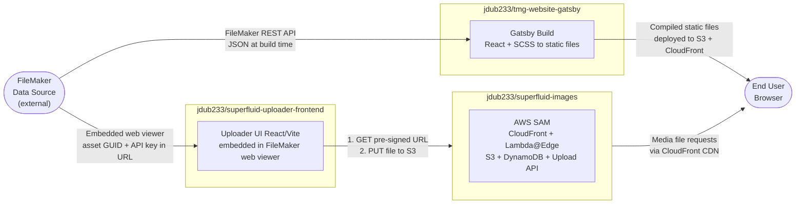

# TMG Website — System Overview

> **For AI coding agents:** This document gives you a map of the full system before you work on any single repo. The diagram below shows repo boundaries and data flows at a high level. Treat each subgraph as a boundary: changes inside one box generally do not require changes in another, but the labeled arrows are the interfaces that must stay consistent.

---

## Repos in this system

| Repo | Purpose |
|---|---|
| `jdub233/tmg-website-gatsby` | Gatsby 5 / React 18 frontend. Fetches JSON from FileMaker at build time, compiles to static files, deployed to S3. |
| `jdub233/superfluid-images` | AWS SAM app: CloudFront CDN, Lambda@Edge (URI rewrite + on-demand resize), S3 storage, DynamoDB GUID-to-filename map, Upload API. |
| `jdub233/superfluid-uploader-frontend` | React/Vite uploader embedded in FileMaker as a web viewer. Gets pre-signed URLs from superfluid-images, uploads directly to S3. |

FileMaker is an external system (hosted by a partner) and is not a repo.

---

## Level 1 System Overview

This diagram shows the three repos as black boxes with labeled flows between them. It intentionally omits internal AWS component detail — see the Miro board for the full internal architecture of `superfluid-images`.

**Reading the diagram:**

- The left-to-right layout reflects two parallel paths: *content* (Gatsby build) and *media* (Superfluid upload and serve).
- FileMaker drives both paths: it is the data source for the Gatsby build and the authoring environment for media uploads.
- The browser receives static HTML/JS/CSS from one origin and media files from a separate CDN origin (`trackr-media.tangiblemedia.org`).
- `superfluid-uploader-frontend` only participates in the write (upload) path — it is not involved in serving media to end users.

---

## Further detail

- **Miro board** (full internal architecture, upload/serve sequence diagrams):
  https://miro.com/app/board/uXjVGxJMKN4=/
- **Notion Project Hub** (stack overview, open work streams, design principles):
  https://www.notion.so/324ae0c3e70a81c7b8f5ea6b5f8b8499
- **Per-repo internal diagrams:** See `docs/` in `superfluid-images` and `superfluid-uploader-frontend` (planned).
